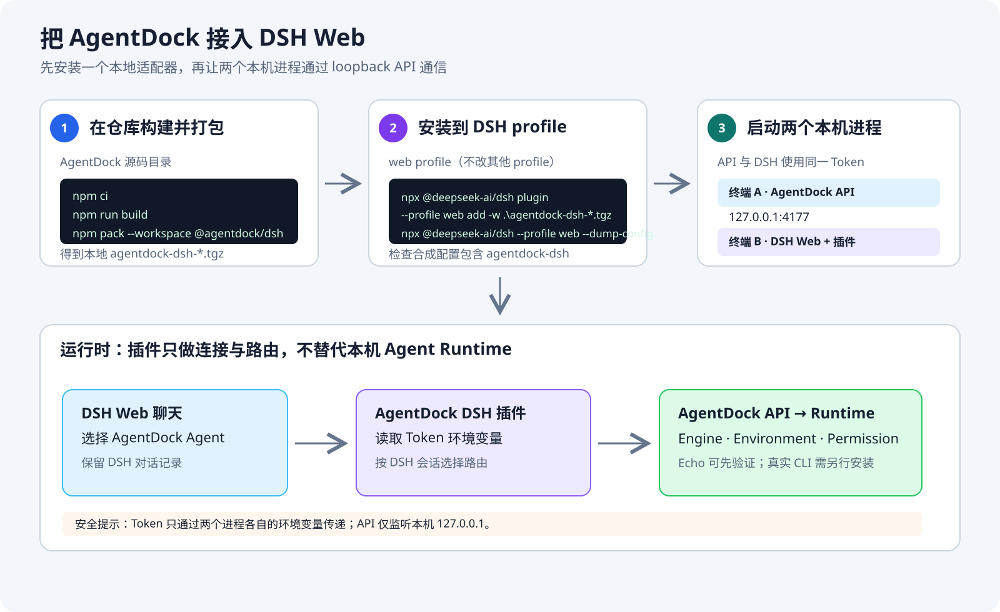
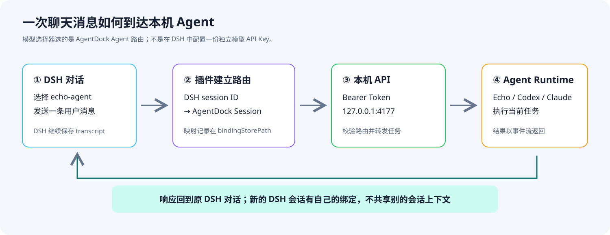
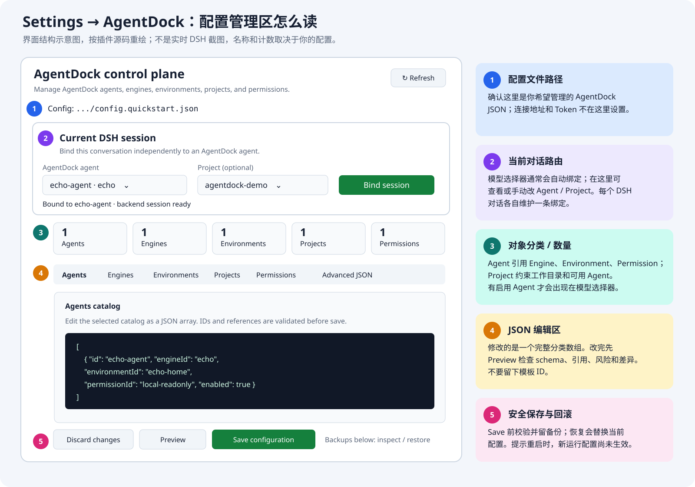

# AgentDock DeepSeek Harness（DSH）插件：安装、配置与上手

> 本仓库实现的是 DeepSeek Harness（简称 **DSH**）插件。如果你说的“ASH”是指其他宿主应用，请先确认宿主名称；下文的命令专用于 DSH。

这份指南从“插件是什么”讲到“如何安装、启动、验证和卸载”。最短路径使用 AgentDock 自带的 Echo Agent，不需要先安装 Codex、Claude Code 或模型 API。



图示是根据仓库当前插件代码绘制的操作示意，不是从用户机器截取的运行截图。DSH 版本、主题、Agent 名称和端口可能使实际界面略有不同。

## 1. 先分清四个组件

| 组件 | 在哪里 | 做什么 | 是否由本插件安装 |
| --- | --- | --- | --- |
| AgentDock Core | 本仓库 `packages/core/` | 提供本机 API、Agent/Environment/Project 配置、路由和任务执行 | 否；本地构建并运行 |
| DeepSeek Harness（DSH） | `@deepseek-ai/dsh` 的 Web profile | 提供聊天页面、会话记录和模型选择器 | 否；通过 DSH CLI 启动 |
| AgentDock DSH 插件 | 本仓库 `packages/dsh/`，npm 包名 `@agentdock/dsh` | 给 DSH 添加 AgentDock 模型提供方与 Settings → AgentDock 管理页面 | 是；打成一个本地 `.tgz` 加到 DSH profile |
| Agent Runtime | 例如 Codex CLI、Claude Code CLI；也可用内置 Echo | 实际执行任务并生成 Agent 回复 | 否；真实 Runtime 需要单独安装、登录 |

插件不是 Agent Runtime，也不会替你安装/登录 Codex 或 Claude Code。DSH 负责聊天界面和 transcript；AgentDock 负责把所选 Agent 的新消息交给本机 Runtime。Echo 只回显输入，适合先确认安装和连通性。

## 2. 安装前准备

- Windows PowerShell；下文命令按 PowerShell 语法书写。
- Node.js `>=22.5` 和 npm。
- 已检出的 AgentDock 仓库。以下步骤都从仓库根目录运行。
- 首次用 `npx @deepseek-ai/dsh` 时需要能从 npm registry 下载 DSH。
- 使用真实 Agent 时，需要额外安装并登录相应 Agent CLI；纯安装验证可用 Echo。

先检查 Node/npm 和所在目录：

```powershell
node --version
npm --version
Get-Location
```

`Get-Location` 应显示 AgentDock 仓库根目录，也就是同时能看到 `package.json` 和 `packages/` 的目录。

## 3. 构建并安装 DSH 插件

### 3.1 安装仓库依赖并打包

```powershell
npm ci
npm run build
npm pack --workspace @agentdock/dsh
```

- `npm ci` 按 lockfile 安装整个 monorepo 的依赖。
- `npm run build` 构建 AgentDock Core 和 DSH 插件。
- `npm pack --workspace @agentdock/dsh` 将 DSH 插件打成 npm tarball；终端会打印实际文件名，例如 `agentdock-dsh-0.1.3-dev.tgz`。后续命令必须使用你本机打印出来的文件名；如果多个 tarball 并存，不要猜最新的那个。
- 插件包自带 DSH 侧需要的控制面代码；安装本地 tarball 不要求先发布 AgentDock Core 到 npm。

### 3.2 将 tarball 加入 DSH 的 `web` profile

把下面示例中的文件名替换成刚才 `npm pack` 实际打印的名字：

```powershell
npx @deepseek-ai/dsh plugin --profile web add -w .\agentdock-dsh-0.1.3-dev.tgz
npx @deepseek-ai/dsh --profile web --dump-config
```

含义：

- `plugin ... add` 是 DSH 的 profile 插件管理命令。
- `--profile web` 指定只安装到 DSH 的 `web` profile；如果你运行的是另一个 profile，安装和启动都应使用同一个 profile 名称。
- `-w .\...tgz` 按 DSH 插件管理命令的本地包方式添加刚生成的 tarball。
- `--dump-config` 打印 profile 的合成配置、不启动聊天 UI；首次运行时它也可能初始化缺失的 profile 文件。输出里应能找到插件 ID `agentdock-dsh` 或包名 `@agentdock/dsh`。如果把输出发给别人排错，先检查并遮盖其中可能存在的本机路径或敏感配置。

默认 DSH home 位于 `%USERPROFILE%\.dsh`；若设置了 `DSH_HOME`，则以该目录为准。`web` profile 的插件清单、依赖和 Cordis patch 通常在：

```text
%USERPROFILE%\.dsh\profiles\web\
  package.json                 profile 的依赖清单
  pnpm-lock.yaml               profile 插件依赖锁定信息
  dsh.profile                  profile 的 bundle 启用清单
  cordis.patch.yml             profile 的插件配置覆盖层
  node_modules\                profile 安装的插件包
```

不要把整个 `%USERPROFILE%\.dsh` 当成 AgentDock 项目目录：它是 DSH 自己的 profile/home；AgentDock 配置与数据库仍由 AgentDock 的配置文件及 `dataDir` 决定。

## 4. 指定 AgentDock 配置文件

插件默认从“启动 DSH 时的当前目录”读取 `.agentdock/config.json`。快速上手示例配置实际位于 `packages/core/examples/config.quickstart.json`，所以我们要在 DSH profile 中把 `configPath` 指向它，并让 API 与 DSH 使用同一份配置。

确认当前目录仍是 AgentDock 仓库根目录，然后打开 web profile 的 patch 文件：

```powershell
$profileHome = if ($env:DSH_HOME) { $env:DSH_HOME } else { Join-Path $env:USERPROFILE '.dsh' }
$patchPath = Join-Path $profileHome 'profiles\web\cordis.patch.yml'
notepad $patchPath
```

保留文件中原有的其他插件条目，只新增或合并下面这个 `agentdock-dsh` 条目：

```yaml
- id: agentdock-dsh
  name: '@agentdock/dsh'
  config:
    configPath: 'packages/core/examples/config.quickstart.json'
    apiBaseUrl: 'http://127.0.0.1:4177'
    apiTokenEnv: 'AGENTDOCK_API_TOKEN'
    bindingStorePath: '.agentdock/dsh-session-bindings.json'
```

字段含义：

| 字段 | 含义 |
| --- | --- |
| `id` / `name` | 必须匹配插件的 ID 和 npm 包名。 |
| `configPath` | AgentDock 的业务配置文件；相对路径按启动 DSH 的当前目录解析。因此后续要从 AgentDock 仓库根目录启动 DSH。 |
| `apiBaseUrl` | AgentDock 本机 API 地址。插件会在其后拼上 `/api/v1`；不要在这里填 `/api/v1`。 |
| `apiTokenEnv` | 保存 API Token 的环境变量**名称**，不是 Token 本身。不要把真实 Token 写进 YAML 或提交到 Git。 |
| `bindingStorePath` | DSH 会话到 AgentDock Session 的映射文件；相对路径同样以 DSH 启动目录为准。它不是聊天 transcript 或 API 数据库。 |

重要：当 patch 中出现相同插件 `id` 时，DSH 会用 patch 中的 `config` 完整覆盖包内默认配置。因此自定义配置不要只写一个 `configPath` 后就删掉其余字段；至少保留 `apiBaseUrl`、`apiTokenEnv` 和 `bindingStorePath`。DSH 还支持 `$DSH_HOME/cordis.patch.yml` 机器级覆盖层，它的优先级高于 profile 自己的 patch；如果 profile 文件写对了但启动结果仍不同，也要检查这个 home-level patch。更多 profile、插件命令和配置层说明见 [DSH 官方 CLI 行为参考](https://github.com/deepseek-ai/deepseek-harness/blob/master/apps/cli/reference/README.md)。

如果你已经有自己的 AgentDock 配置，将上面的 `configPath` 换成它的路径，并在 API 启动命令中使用相同路径。**API 和插件必须连接同一份 AgentDock 配置**，否则 DSH 看到的 Agent 列表可能不是你预期的那一套。

## 5. 启动 API 和 DSH（Echo 快速验证）

API 和 DSH 是两个独立进程，需要两个 PowerShell 窗口。请从仓库根目录打开这两个窗口。

### 终端 A：启动 AgentDock API

```powershell
$env:AGENTDOCK_API_TOKEN = [guid]::NewGuid().ToString('N')
Write-Host "请把这个本机临时 Token 复制到终端 B：$env:AGENTDOCK_API_TOKEN"
node .\packages\core\dist\cli.js api serve --config .\packages\core\examples\config.quickstart.json --port 4177
```

保持终端 A 运行。Token 是本机 API 的 Bearer Token，只需供本机 DSH 进程使用；不要贴到 Wiki、截图、聊天消息、Git 或公开 issue 中。API 只绑定 `127.0.0.1`，不是给局域网或公网访问的。

### 终端 B：把同一个 Token 交给 DSH 进程

将下面占位符替换成终端 A 刚才显示的临时 Token：

```powershell
$env:AGENTDOCK_API_TOKEN = '替换为终端 A 显示的同一个 Token'
npx @deepseek-ai/dsh web
```

`$env:...` 只对当前 PowerShell 进程及其子进程生效。不要关闭终端 A；若在终端 B 修改 Token，必须重启 DSH 才会读取新值。`npx @deepseek-ai/dsh web` 会启动 `web` profile；从仓库根目录运行是为了让上面的相对 `configPath` 能正确解析。

### 在浏览器中确认它已连通

打开 DSH 启动日志显示的本地 Web 地址。在聊天页的模型选择器中选择 AgentDock 提供的 `echo-agent`，再发送一条短消息，例如：

```text
请原样回复：AgentDock DSH 已连通
```

如果回复原样回显输入，就表示 DSH 插件已被加载、Token/API 路径已连通、AgentDock 能路由到 Echo。Echo 不会生成智能回答，也不能用来判断真实模型质量。



上图为操作/数据流示意，不是实际 DSH 截图：选择器选择的是已启用 AgentDock Agent；发送消息后，当前 DSH 会话会映射到对应的 AgentDock Session。不同 DSH 会话彼此独立。

## 6. Settings → AgentDock 页面怎么用

在 DSH 的 Settings 中打开 **AgentDock** 页面。这里管理的是 `configPath` 指向的 AgentDock 业务配置，不负责安装 Agent Runtime，也不负责保存 API 地址或 Token。



上图按 `packages/dsh/src/client.ts` 的真实界面结构绘制；布局和文字会随版本、主题及配置变化。主要区域含义如下：

1. **Config 路径**：显示当前页面实际编辑的 AgentDock 配置文件。如果不是你想要的文件，先检查 `configPath` 和启动目录。
2. **Current DSH session**：针对当前聊天会话选择 AgentDock Agent，可选绑定一个 Project，然后按 **Bind session** 明确保存路由。大多数情况下直接在聊天模型选择器中选择 Agent 并发送消息即可自动绑定；这里适用于查看或手动调整当前会话。
3. **配置分类与数量**：Agents、Engines、Environments、Projects、Permissions 是 AgentDock 配置中的对象集合。Agent 必须关联有效 Engine、Environment 和 Permission；Project 可以限制允许使用的 Agent 并提供工作目录。
4. **JSON 编辑区**：切换分类后编辑该分类的完整 JSON 数组。新增后需填写真实 ID 和对应引用，不要只保留 `new-agent` 这类模板占位符。
5. **Preview / Save / Backups**：先 Preview 查看校验问题、高风险提示和差异，再 Save。保存会进行配置校验并保留备份；若提示需要重启 API，新的运行时配置要在重启后生效。Backups 区可恢复最近的备份。

建议第一次只用已有的 `echo-agent` 验证，不要在 Settings 里先随意改 Permission 或目录权限。要新增真实 Agent，可依次确认 Runtime/Engine 已安装可运行、Environment 配置正确、Permission 满足预期，然后创建 Agent 并在 Preview 中检查引用和风险。

## 7. DSH 会话、AgentDock Session 和数据文件

- DSH 保存聊天 UI 和 transcript；AgentDock 收到的是本轮用户输入及选择的 Agent 路由。
- 一个 DSH 会话对应一个 AgentDock Session 绑定。切换 Agent 会切换路由，不会把不同 Agent 的原生会话混成一个会话。
- 默认绑定文件是 DSH 启动目录下的 `.agentdock/dsh-session-bindings.json`，只保存 DSH 会话与 AgentDock Session 的映射元数据。
- AgentDock 的 SQLite、Environment 和 Run 数据位置由所选配置里的 `dataDir` 控制。Echo 示例解析到仓库根目录下的 `.agentdock/quickstart-data/`。
- Token 只通过 `AGENTDOCK_API_TOKEN` 交给本机进程；不要把 Token 放到 `cordis.patch.yml` 或 AgentDock JSON 配置中。
- API 使用 loopback 地址 `127.0.0.1`。这不意味着 Permission 是 OS 级沙箱；Agent 执行能力仍取决于对应 Runtime、权限策略和本机账户。

## 8. 使用真实 Codex / Claude Code Agent

Echo 连接成功后，再切换到你自己的 AgentDock 配置：

1. 按 AgentDock 的 Runtime/Environment 指南安装并登录本机 Codex 或 Claude Code CLI。
2. 在 AgentDock 配置中创建并启用对应 Engine、Environment、Permission 和 Agent；确保 Agent 的引用 ID 都存在。
3. 修改 DSH patch 的 `configPath`，使其指向这份配置，并从预期目录启动 DSH。
4. 同一份文件也传给 AgentDock API 的 `--config` 参数。
5. 重启 API 和 DSH，在模型选择器中选对应 Agent。先通过 Settings 的 Preview 检查配置，不要为了“让它出现”就扩大文件或网络权限。

插件只是调用 AgentDock API，不提供模型额度，也不会代替本机 CLI 登录。

## 9. 升级、重装与卸载

### 重新安装本地构建版本

当源码变更后，重新构建并打包。若包版本号没有变，DSH profile 可能仍用旧的展开文件或前端 bundle，需先移除再添加：

```powershell
npm run build
npm pack --workspace @agentdock/dsh
npx @deepseek-ai/dsh plugin --profile web remove -w @agentdock/dsh
npx @deepseek-ai/dsh plugin --profile web add -w .\agentdock-dsh-0.1.3-dev.tgz
npx @deepseek-ai/dsh --profile web --dump-config
```

将 `.tgz` 文件名替换成 npm 实际输出的名字。只操作 `web` profile 中的 `@agentdock/dsh`，不要为了排错移除其他插件。

### 卸载

```powershell
npx @deepseek-ai/dsh plugin --profile web remove -w @agentdock/dsh
```

这只从 DSH 的 `web` profile 移除插件，不会删除 AgentDock JSON 配置、SQLite 历史、Environment、DSH transcript 或绑定文件。确认不再需要后，再分别备份和清理这些本机数据。

## 10. 常见问题

| 现象 | 常见原因 | 处理方式 |
| --- | --- | --- |
| 模型选择器没有 AgentDock / `echo-agent` | API 未启动、Token 错误，或 Agent 被禁用 | 确认终端 A API 仍运行；终端 B Token 与 A 完全一致；API 和插件指向同一配置；Agent `enabled` 为 `true`。 |
| `TOKEN_MISSING` | 启动 DSH 的终端没有设置 `AGENTDOCK_API_TOKEN` | 在终端 B 设置变量后重新启动 DSH。只在终端 A 设置不会自动同步到另一个 PowerShell 窗口。 |
| `UNREACHABLE` / 连接 `127.0.0.1:4177` 失败 | API 没运行、端口不同或 DSH 配错地址 | 检查 API 命令的 `--port` 和 DSH patch 的 `apiBaseUrl` 一致；确认两者都是本机 loopback 地址。 |
| Settings 显示错误配置，或 `configPath` 不存在 | 相对路径是相对 DSH 启动目录解析的 | 从仓库根目录启动 DSH，或改为正确路径；API 的 `--config` 也要指向同一个文件。 |
| 可以打开 DSH，但插件页面旧/未更新 | 同版本重新打包后 profile 仍使用旧 bundle | 在 `web` profile 移除 `@agentdock/dsh`，重新添加新 tarball，再重启 DSH。 |
| Echo 只复读消息 | 这是 Echo 的预期行为 | 它只用于验证流程，不是模型。配置真实 Agent 并确保对应 CLI 已安装、登录。 |

更多 AgentDock 安装、架构和配置概念见 [快速开始 Wiki](./wiki/getting-started.md)、[架构说明](./wiki/architecture.md) 和 [构建与本地部署](./wiki/build-and-deploy.md)。
